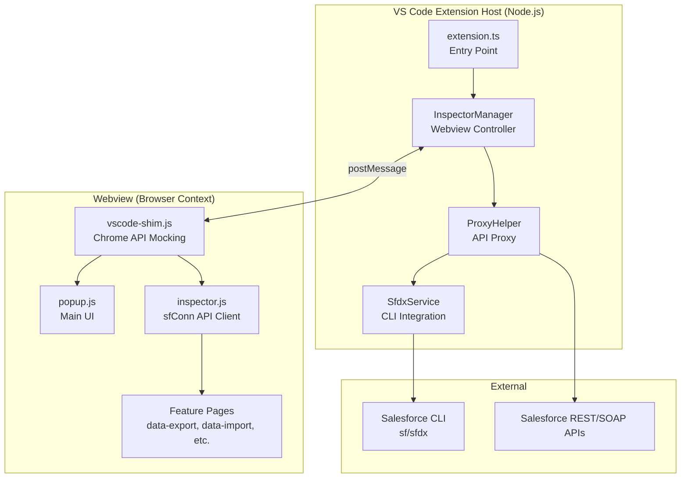
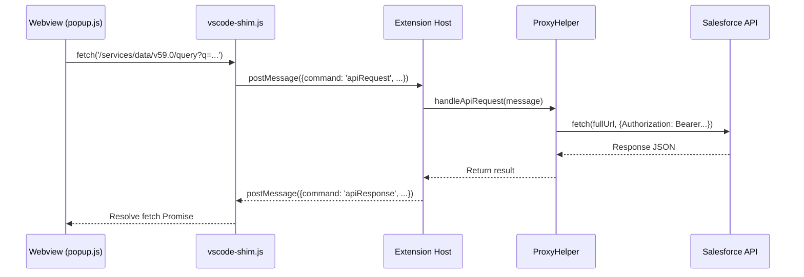

# Salesforce Inspector Reloaded VS Code Extension - Project Overview

This document provides a comprehensive reference for the project architecture, enabling AI agents or developers to understand the codebase without further exploration.

---

## Quick Reference

| Item               | Value                                                                          |
| ------------------ | ------------------------------------------------------------------------------ |
| **Name**           | `salesforce-inspector-reloaded-vscode`                                         |
| **Version**        | `1.0.0`                                                                        |
| **Publisher**      | `fahadali`                                                                     |
| **Repository**     | [GitHub](https://github.com/FahadAli789/Salesforce-Inspector-reloaded-Vs-Code) |
| **VS Code Engine** | `^1.80.0`                                                                      |
| **Entry Point**    | `./out/extension.js` (compiled from `src/extension.ts`)                        |

---

## Project Purpose

This is a **VS Code port** of the [Salesforce Inspector Reloaded](https://github.com/tprouvot/Salesforce-Inspector-reloaded) Chrome/Firefox extension. It brings the powerful Salesforce development tools (data export, import, API exploration, org limits, metadata retrieval) directly into VS Code, eliminating the need for a browser.

---

## Architecture Overview



---

## Directory Structure

```
salesforce-inspector-vscode/
├── src/                     # TypeScript source (Extension Host)
│   ├── extension.ts         # Main entry, activates extension
│   ├── proxyHelper.ts       # Handles API proxying to Salesforce
│   └── sfdxService.ts       # Interfaces with `sf`/`sfdx` CLI
├── media/                   # Webview assets (ported from Chrome extension)
│   ├── popup.js             # Main popup UI (React)
│   ├── inspector.js         # Core API connection client (sfConn)
│   ├── vscode-shim.js       # Mocks chrome.runtime for VS Code
│   ├── data-export.js       # Data Export feature (SOQL queries)
│   ├── data-import.js       # Data Import feature
│   ├── inspect.js           # "Show All Data" feature
│   ├── limits.js            # Org Limits viewer
│   ├── explore-api.js       # API Explorer
│   ├── metadata-retrieve.js # Metadata retrieval
│   ├── flow-scanner.js      # Flow analysis
│   ├── field-creator.js     # Field creation tool
│   ├── components/          # Reusable UI components (React)
│   ├── lib/                 # Third-party libraries
│   └── *.html               # HTML entry points for each page
├── out/                     # Compiled JavaScript output
└── package.json             # Extension manifest
```

---

## Core Components

### 1. `src/extension.ts` - Extension Entry Point

- **Purpose**: Activates the extension, sets up webview provider, registers commands.
- **Key Classes**:
  - `InspectorManager`: Manages webview setup, loads HTML pages, handles message passing
  - `InspectorViewProvider`: Implements `WebviewViewProvider` for sidebar view
- **Commands**:
  - `salesforce-inspector.openInspector`: Opens in sidebar
  - `salesforce-inspector.openInspectorTab`: Opens in new editor tab
- **Message Handling**: Listens for messages from webview and routes to `ProxyHelper`

### 2. `src/proxyHelper.ts` - API Proxy Layer

- **Purpose**: Routes all Salesforce API calls from webview through Extension Host to bypass CORS.
- **Key Methods**:
  - `handleApiRequest(message)`: Proxies REST/SOAP calls to Salesforce
  - `handleCometdRequest(message)`: Handles CometD streaming requests
- **Authentication**: Uses access token from `SfdxService`, auto-refreshes on 401 errors
- **SOAP Handling**: Replaces `dummy-session-id-handled-by-vscode` placeholder with real token

### 3. `src/sfdxService.ts` - Salesforce CLI Integration

- **Purpose**: Retrieves org credentials from Salesforce CLI (`sf` or `sfdx`)
- **Key Method**: `getDefaultOrg(forceRefresh?)` - Returns `SalesforceOrg` with:
  - `accessToken`
  - `instanceUrl`
  - `username`
  - `alias`
- **Caching**: Caches org info for 1 hour; refreshes on 401 or forced
- **CLI Command**: Executes `sf org display --json` (falls back to `sfdx`)

### 4. `media/vscode-shim.js` - Chrome API Compatibility Layer

- **Purpose**: Makes Chrome extension code work in VS Code webviews
- **Key Mocks**:
  - `window.chrome.runtime`: Mocked with `getManifest()`, `getURL()`, `onMessage`
  - `window.fetch`: Overridden to route through Extension Host via `postMessage`
  - `XMLHttpRequest`: Intercepted for CometD requests
  - `window.open()`: Routes to `vscode.env.openExternal`
- **Message Protocol**: Uses `requestId` to match async responses from Extension Host

### 5. `media/inspector.js` - Core API Client (`sfConn`)

- **Purpose**: Provides unified API for making Salesforce REST/SOAP calls
- **Key Export**: `sfConn` object with methods like:
  - `sfConn.rest(url)`: Makes REST API calls
  - `sfConn.soap(soapBody, opts)`: Makes SOAP API calls
- **Session Handling**: Uses `sessionId` for authentication

### 6. `media/popup.js` - Main UI (React)

- **Purpose**: Main popup interface with navigation to all features
- **Components**:
  - `App`: Main application component
  - `AllDataBox`: Search box for objects/users/shortcuts
  - `AllDataBoxSObject`, `AllDataBoxUser`, etc.: Search result views
- **VS Code Proxy Mode**: Detects `isVSCodeProxyMode` parameter and initializes accordingly

---

## Feature Pages

| Page              | File                   | Purpose                                      |
| ----------------- | ---------------------- | -------------------------------------------- |
| Data Export       | `data-export.js`       | Run SOQL/SOSL queries, export results as CSV |
| Data Import       | `data-import.js`       | Bulk import data to Salesforce               |
| Show All Data     | `inspect.js`           | View record details, field metadata          |
| Org Limits        | `limits.js`            | Display org usage limits                     |
| API Explorer      | `explore-api.js`       | Interactive REST API testing                 |
| Metadata Retrieve | `metadata-retrieve.js` | Download metadata components                 |
| Flow Scanner      | `flow-scanner.js`      | Analyze Flow configurations                  |
| Field Creator     | `field-creator.js`     | Create custom fields                         |
| REST Explore      | `rest-explore.js`      | Raw REST API testing                         |
| Event Monitor     | `event-monitor.js`     | Platform event monitoring                    |

---

## Communication Flow



---

## Dependencies

### Runtime Dependencies (Node.js)

- `express` (v5.2.1): Local proxy server (legacy, now using direct messaging)
- `body-parser`: Request parsing
- `cors`: CORS handling

### Dev Dependencies

- `typescript` (v5.1.3): TypeScript compiler
- `@types/vscode`: VS Code API types
- `eslint`: Linting

### Bundled Libraries (media/lib/)

- `React` & `ReactDOM`: UI framework
- Various utility libraries

---

## Key Technical Decisions

1. **No CORS Proxy Server**: Originally used Express server; now uses direct `postMessage` communication between webview and Extension Host, making it compatible with cloud IDEs.

2. **Chrome API Shimming**: Rather than rewriting original extension code, `vscode-shim.js` mocks `chrome.runtime`, `fetch`, and `XMLHttpRequest`.

3. **SFDX CLI Authentication**: Leverages existing Salesforce CLI session instead of implementing OAuth flow.

4. **React in Webview**: Original extension's React UI works unchanged in VS Code webviews.

---

## Common Patterns

### Adding a New Feature Page

1. Create `media/new-feature.html` with standard boilerplate
2. Create `media/new-feature.js` with React/vanilla JS logic
3. Page is loaded via `InspectorManager._loadPage(webview, 'new-feature.html')`
4. Use `sfConn.rest()` or `sfConn.soap()` for API calls

### Making API Calls

```javascript
// In webview code (uses shimmed fetch)
let result = await sfConn.rest(
  "/services/data/v59.0/sobjects/Account/describe"
);
```

### Handling Navigation

Navigation between pages uses URL parameters:

- `?host=<instance>` - Salesforce instance URL
- `?objectType=<sobject>` - Object API name for inspect pages

---

## Known Considerations

1. **sfHost Initialization**: Some pages need `sfHost` from URL params; ensure it's passed correctly when navigating.

2. **Token Refresh**: On 401 errors, `ProxyHelper` automatically refreshes token via `SfdxService.getDefaultOrg(true)`.

3. **SVG Icons**: Uses `svg-loader.js` to inline `symbols.svg` for icon references.

4. **Clipboard Shortcuts**: `vscode-shim.js` intercepts Cmd+A/C/V/X/Z for proper clipboard handling in webviews.

---

## Development Commands

```bash
# Compile TypeScript
npm run compile

# Watch mode
npm run watch

# Lint
npm run lint

# Package extension
vsce package
```

---

## Related Files for Debugging

- Extension output: View → Output → Select "Salesforce Inspector"
- Webview console: Developer → Toggle Developer Tools (on webview)
- API errors logged via `vscode-shim.js` error handlers
